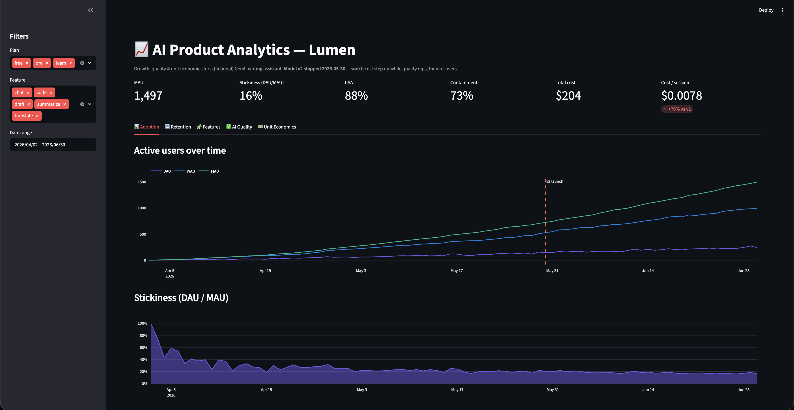

# ai-product-analytics 📈

[](https://github.com/himanshutamboli/ai-product-analytics/actions/workflows/ci.yml)
[](https://www.python.org/)
[](https://github.com/astral-sh/ruff)
[](#roadmap)

> The **PM / growth analytics** view of a live GenAI product — North Star + adoption, retention
> cohorts, feature funnels, AI quality & CSAT, and unit economics — in one Streamlit dashboard.
> The product-side counterpart to [`llm-observatory`](https://github.com/himanshutamboli/llm-observatory)'s
> engineer-side view.

## Why this exists

Engineers watch traces, latency, and error rates. **Product** watches a different scoreboard:
are people adopting the AI features, coming back, getting value — and does the unit economics
work as usage grows? This dashboard answers those questions for a (fictional) AI writing
assistant, on a deterministic synthetic dataset that tells a real story: steady growth, then a
**v2 model launch that lifts capability but spikes token cost and briefly dips quality** — the
kind of tradeoff a PM has to see and manage.

## Demo



The seeded story, visible at a glance: adoption climbs, then at the **v2 launch (2026-05-30)**
answer quality dips (recovering after the fix two weeks later) while **cost per session steps up
~70% and stays there** — capability isn't free, and the dashboard makes the tradeoff explicit.

## What it shows

- **KPI header** — MAU, stickiness (DAU/MAU), CSAT, containment, total cost, cost/session.
- **Adoption** — DAU/WAU/MAU and stickiness over time.
- **Retention** — weekly signup-cohort retention heatmap.
- **Features** — feature reach + the signup → activated → engaged → retained activation funnel.
- **AI quality** — answer-quality & CSAT trend, refusal & containment rates.
- **Unit economics** — token spend and cost per active user / session, broken down by plan/model/feature.
- **Experiments** — randomized A/B readouts with **two-proportion z-tests**: lift, 95% CI, p-value, and a ship / stop / keep-testing decision.

Plan / feature / date filters flow through every view (experiments have their own enrollment).

## Architecture

```
 data.py ──► generate() ──► users + sessions (polars)   [deterministic synthetic GenAI product]
                                   │
                    metrics/ ──────┤  adoption · retention · funnel · quality · economics
                                   │  (pure polars functions → chartable frames)
                                   ▼
                    app.py ──► Streamlit KPI header + 5 tabbed sections + filters (Plotly)
```

Design notes and the metric definitions live in [`docs/architecture.md`](docs/architecture.md).
The dataset is seeded (no clock, no network), so the dashboard and its tests are fully
reproducible in CI.

## Quickstart

```bash
uv sync --dev
uv run ai-product-analytics          # generate the dataset → data/*.parquet + summary
uv run streamlit run app.py          # launch the dashboard
uv run pytest
```

## Roadmap

| Step | Deliverable |
|---|---|
| 1 ✅ | Synthetic GenAI-product dataset (users + sessions) with a built-in growth/quality/cost narrative |
| 2 ✅ | Metrics package: adoption, retention cohorts, feature funnel, AI quality, unit economics |
| 3 ✅ | Streamlit dashboard: KPI header + 5 tabbed sections (adoption/retention/features/quality/economics) with filters |
| 4 ✅ | Docs + demo screenshot; **shipped v1.0** |
| 5 ✅ | A/B experimentation view — two-proportion z-tests, CIs, ship/stop/keep-testing decisions (**v1.1**) |

## License

MIT
